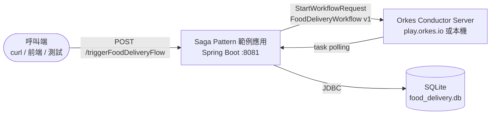
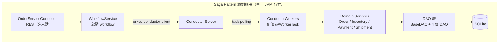
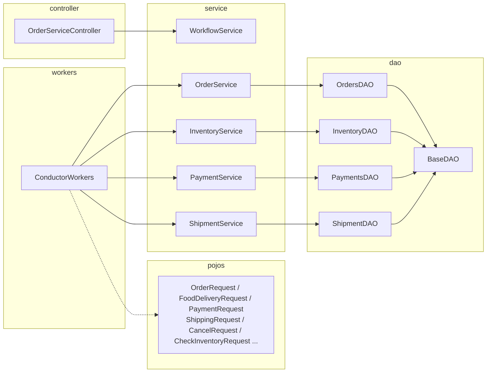
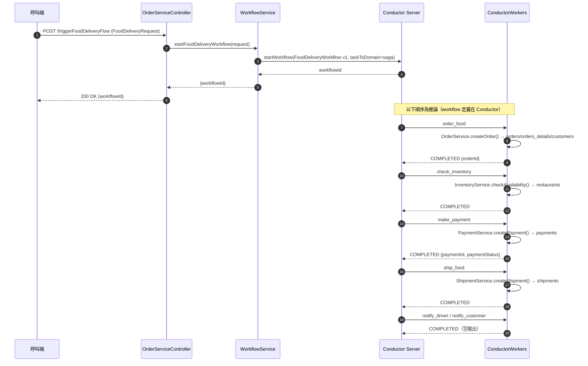
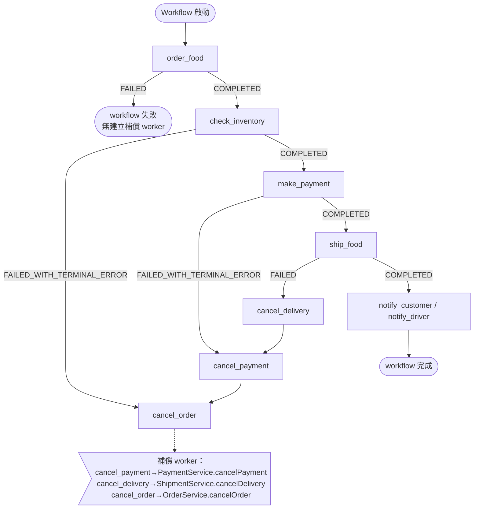
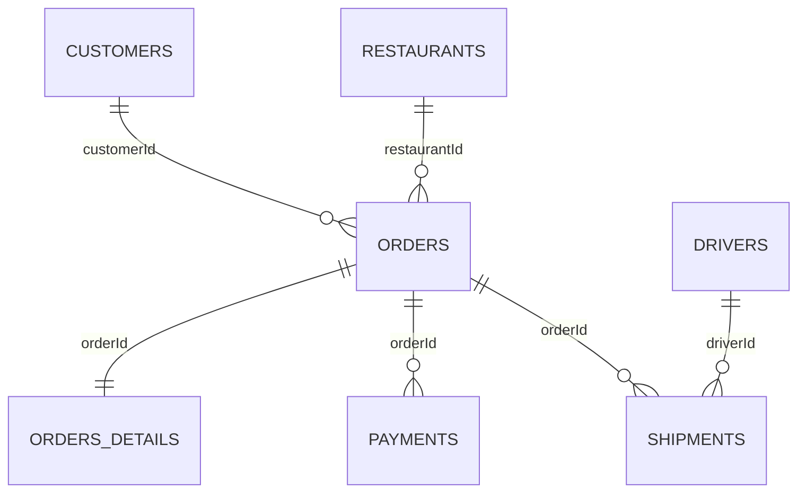
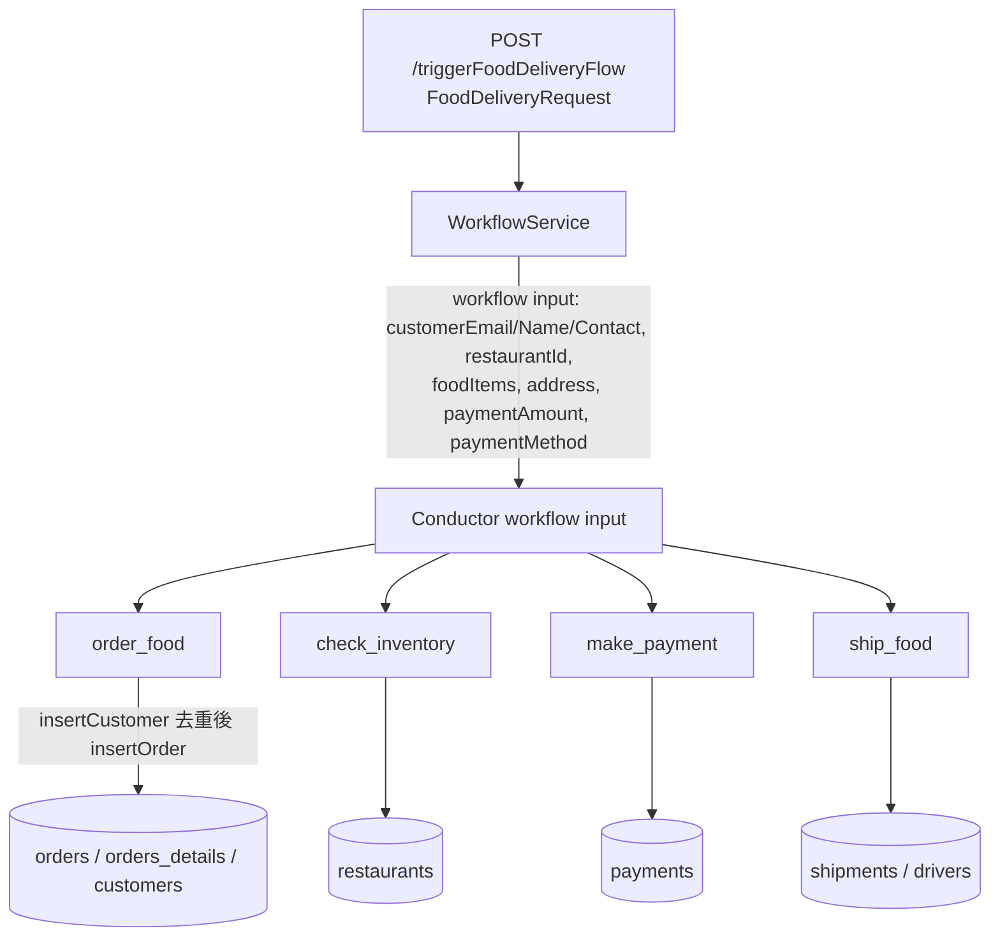
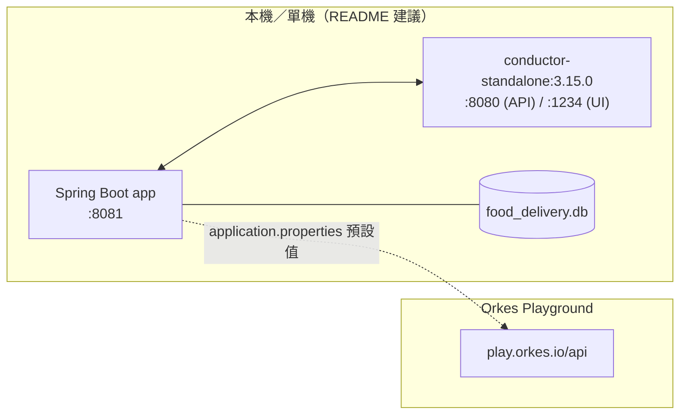

# saga-pattern 系統架構文件

> 分析基準：`tradingbot-tw/saga-pattern` @ `3e8c20c`（trunk `software-factory`）。
> 本文以**靜態分析**產出，所有陳述均附「證據索引」；推論處明確標示。若與實作不符，以程式碼為準。

## 系統概述

saga-pattern 是一個**教學用範例專案**，示範如何以 [Orkes Conductor](https://github.com/conductor-oss/conductor)
建立事件驅動（event driven）的餐點外送流程（`README.md:3`）。專案以 Java + Spring Boot 實作，
使用 Gradle 建置。

- 建置與語言：Gradle、Java（Spring Boot `3.2.3`、Lombok `8.6`）（`build.gradle:1-11`）。
- 專案名稱：`conductor-examples-food-delivery`（`settings.gradle:1`）。
- 應用程式進入點：`SagaApplication`（`src/main/java/io/orkes/example/saga/SagaApplication.java:13-26`）。
- 對外介面：單一 REST 端點 `POST /triggerFoodDeliveryFlow`
  （`src/main/java/io/orkes/example/saga/controller/OrderServiceController.java:23-26`）。
- 程式碼規模：30 個 Java 檔，分為 `controller`、`service`、`workers`、`dao`、`pojos` 五個套件。
- 資料儲存：單一 SQLite 檔 `food_delivery.db`（`src/main/resources/application.properties:29`），
  共 7 張表由 `BaseDAO` 以內嵌 DDL 建立（`src/main/java/io/orkes/example/saga/dao/BaseDAO.java:33-164`）。

### 範圍

- **In scope**：系統邊界、元件、Saga 流程、資料模型、部署／運行視圖、品質屬性與風險、技術債、待確認問題、證據索引。
- **Out of scope**：不修改業務邏輯、不重構、不調整 CI/CD、不部署、不新增 runtime 依賴、不變更資料庫 schema。

### 最關鍵的架構事實

**Saga 的編排（orchestration）不在本 repo 的版控範圍內。** 應用只負責：
(1) 以名稱 `FoodDeliveryWorkflow`（version 1）向外部 Conductor server 啟動 workflow
（`src/main/java/io/orkes/example/saga/service/WorkflowService.java:22-35`）；
(2) 在同一行程內註冊 9 個 Conductor worker task（`src/main/java/io/orkes/example/saga/workers/ConductorWorkers.java:25-128`）。
Workflow 的步驟順序、重試策略與補償關係定義在 Conductor server（預設 `play.orkes.io`），
repo 內看不到，因此下文的 Saga 流程圖**依 task 名稱與 worker 行為推論**，並在圖中標示為推論。

## 架構視圖

### C4 Context（系統情境）

### C4 Container（容器／執行單元）

本專案是**單一行程（single process）**的 Spring Boot 應用，沒有微服務、訊息佇列或跨行程呼叫；
「容器」層級上可辨識的只有應用行程、Conductor server 與 SQLite。

### C4 Component（套件／元件）

元件職責與位置：

| 元件 | 位置 | 職責 |
| --- | --- | --- |
| `OrderServiceController` | `controller/OrderServiceController.java:23-26` | 唯一 HTTP 進入點，轉呼叫 `WorkflowService` |
| `WorkflowService` | `service/WorkflowService.java:22-60` | 組裝 workflow input、啟動 `FoodDeliveryWorkflow` |
| `ConductorWorkers` | `workers/ConductorWorkers.java:21-128` | 註冊 9 個 worker task，呼叫 domain service |
| `OrderService` | `service/OrderService.java:21-71` | 建立／讀取／取消訂單與客戶 |
| `InventoryService` | `service/InventoryService.java:16-22` | 檢查餐廳是否存在（庫存檢查） |
| `PaymentService` | `service/PaymentService.java:22-84` | 建立／取消付款、信用卡到期日驗證（模擬） |
| `ShipmentService` | `service/ShipmentService.java:16-63` | 建立／取消配送、隨機指派司機 |
| `BaseDAO` 與 4 個 DAO | `dao/*.java` | SQLite 連線、DDL、CRUD |

## Saga 流程

### 參與者與 task 清單

`WorkflowService` 啟動名為 `FoodDeliveryWorkflow`（version 1）的 workflow
（`service/WorkflowService.java:24-25`），`correlationId` 固定為 `api-triggered`（`:26`）。
`ConductorWorkers` 註冊下列 9 個 task：

| Task 名稱 | 方法 | threadCount / pollingInterval | 類型 |
| --- | --- | --- | --- |
| `order_food` | `orderFoodTask` | 3 / 300ms | 正向 |
| `check_inventory` | `checkInventoryTask` | 2 / 300ms | 正向 |
| `make_payment` | `makePaymentTask` | 2 / 300ms | 正向 |
| `ship_food` | `shipFoodTask` | 2 / 300ms | 正向 |
| `notify_driver` | `checkForDriverNotifications` | 2 / 300ms | 通知（目前為 no-op） |
| `notify_customer` | `checkForCustomerNotifications` | 2 / 300ms | 通知（目前為 no-op） |
| `cancel_payment` | `cancelPaymentTask` | 2 / 300ms | 補償 |
| `cancel_delivery` | `cancelDeliveryTask` | 2 / 300ms | 補償 |
| `cancel_order` | `cancelOrderTask` | 2 / 300ms | 補償 |

> ⚠️ **推論**：task 之間的先後順序與補償觸發條件由 Conductor 上的 workflow 定義決定，**不在本 repo**。
> 下圖僅依 task 命名慣例與 worker 的狀態語意排列，實際順序須向 Conductor workflow 定義確認（見「待確認問題」）。

### 成功路徑

### 失敗與補償路徑

各 worker 的失敗語意（決定 Conductor 是否重試或走補償）：

- `order_food`：`orderId` 為 `null` 時回 `FAILED`（`workers/ConductorWorkers.java:32-39`）。
- `check_inventory`：餐廳不存在時回 `FAILED_WITH_TERMINAL_ERROR`，原因字串 `Restaurant is closed`
  （`workers/ConductorWorkers.java:51-56`）——terminal error 不會重試。
- `make_payment`：付款狀態非 `SUCCESSFUL` 時回 `FAILED_WITH_TERMINAL_ERROR`
  （`workers/ConductorWorkers.java:71-76`）。
- `ship_food`：司機指派失敗（`driverId == 0`）時回 `FAILED`（可重試）（`workers/ConductorWorkers.java:88-92`）。
- 補償 worker `cancel_payment`／`cancel_delivery`／`cancel_order` 皆回傳空 `Map`，未設定失敗狀態
  （`workers/ConductorWorkers.java:108-128`）。

> ⚠️ **推論**：補償的**觸發與連結**（哪個 task 失敗觸發哪個補償、是否使用 Conductor 的
> `SIMPLE`/`DO_WHILE` 等結構）在 Conductor workflow 定義內，repo 看不到。上圖的連結關係是
> 依 task 命名與領域語意的**候選推論**，非版控事實。

### 冪等與重試（現況）

- repo 內**沒有**任何冪等鍵（idempotency key）、去重或交易邊界邏輯；`correlationId` 固定為
  `api-triggered`（`service/WorkflowService.java:26`），無法用它區分不同請求。
- 重試策略（`retryCount`、`retryLogic`、timeout）全部在 Conductor workflow 定義內，repo 無從得知。
- worker 只設定了執行緒數與輪詢間隔（`@WorkerTask(...)`），非重試策略。

## 資料模型

### 關聯（邏輯關聯；DDL 未宣告 FOREIGN KEY）

### 資料表（`dao/BaseDAO.java` 內嵌 DDL）

| 表 | 主鍵 | 欄位 | 建立位置 |
| --- | --- | --- | --- |
| `orders` | `orderId` (text) | customerId, restaurantId, deliveryAddress, createdAt, status | `BaseDAO.java:55-69` |
| `orders_details` | `orderId` (text) | items, notes | `BaseDAO.java:71-81` |
| `customers` | `id` (autoincrement) | email, name, contact | `BaseDAO.java:83-98` |
| `restaurants` | `id` (autoincrement) | name, address, contact | `BaseDAO.java:100-113` |
| `payments` | `paymentId` (text) | orderId, amount, method, status, createdAt | `BaseDAO.java:116-131` |
| `drivers` | `id` (autoincrement) | name, contact | `BaseDAO.java:133-147` |
| `shipments` | `id` (autoincrement) | orderId, driverId, address, instructions, status, createdAt | `BaseDAO.java:148-164` |

狀態列舉（Java enum，以 `name()` 字串落地）：

- `Order.Status`：`PENDING`、`ASSIGNED`、`CONFIRMED`、`CANCELLED`（`pojos/Order.java:10-15`）。
- `Payment.Status`：`PENDING`、`FAILED`、`SUCCESSFUL`、`CANCELED`（`pojos/Payment.java:7-12`）。
- `Shipment.Status`：`SCHEDULED`、`CONFIRMED`、`DELIVERED`、`CANCELED`（`pojos/Shipment.java:7-12`）。

> ⚠️ 現況：`OrderService` 只會寫入 `PENDING`（`service/OrderService.java:39`）與 `CANCELLED`
> （`service/OrderService.java:68`）；`ASSIGNED`、`CONFIRMED` 在 repo 內沒有任何程式碼會設定。
> `Shipment` 則只會落地 `SCHEDULED`、`CONFIRMED`、`CANCELED`（`ShipmentDAO.java:27,39,51`），
> `DELIVERED` 未被使用。

### 資料流

注意：`WorkflowService` 會把 `customerEmail`、`customerName`、`customerContact` 直接放入
workflow input（`service/WorkflowService.java:37-48`），因此這些欄位會被送往外部 Conductor server
（預設 `play.orkes.io`）。目前 repo 內為 demo 假資料，但變更此路徑時需留意資料外送面。

### 種子資料與已知不一致

啟動時 `SagaApplication.initDB()` 依序建立 `orders`、`inventory`、`payments`、`shipments`
四組表（`SagaApplication.java:22-26`），`BaseDAO.createTables()` 對應建立 7 張表
（`BaseDAO.java:33-53`），並寫入種子資料：3 位客戶、3 間餐廳、4 位司機
（`BaseDAO.java:166-206`）。

- ⚠️ `seedCustomers()` 的 INSERT 欄位順序為 `(email, name, contact)`，但值為
  `('John Smith','john.smith@example.com', ...)`——姓名與 email 寫反（`BaseDAO.java:167-171`）。
- ⚠️ `seedRestaurants()` 的 INSERT 欄位順序為 `(name, address, contact)`，但值為
  `('Mikes','+12121231345','<地址>')`——電話與地址寫反（`BaseDAO.java:184-188`）。
- 種子資料本身為示範用途，非正式資料（`catalog-info.yaml:54-55` 之風險說明）。

## 部署與運行

### 運行視圖

### 執行方式（依 repo 可見設定）

- 前置需求：Docker 與一個執行中的 Conductor server（`README.md:5-14`）：
  `docker run --init -p 8080:8080 -p 1234:5000 conductoross/conductor-standalone:3.15.0`。
- 應用程式監聽埠 `8081`（`application.properties:10`）。
- Conductor 連線預設為 `https://play.orkes.io/api`，需要 `client.key-id` / `client.secret`
  （`application.properties:16-18`，目前為 `<key>` / `<secret>` 佔位符）。
- Worker task domain 設為 `saga`（`application.properties:22`）；`WorkflowService` 會把
  `taskToDomain` 中所有 task 指向該 domain（`service/WorkflowService.java:28-35`）。
- 資料庫：SQLite JDBC，`jdbc:sqlite:food_delivery.db`（`application.properties:29-31`；
  `SagaApplication.java:20`），DB 檔由 `.gitignore` 排除（`.gitignore` 的 `*.db` / `food_delivery.db`）。

### 部署缺口

- repo 內**沒有** `Dockerfile`、k8s manifest、部署腳本或 CI workflow（`.github/` 下僅有
  `factory/risk-paths.yml`）；沒有 Docker Compose 一鍵啟動。
- repo 內**沒有** Gradle wrapper（`gradlew`、`gradle/wrapper/`），README 也未提供啟動應用
  的指令；本機是否以系統 `gradle` 執行需人工確認（見「待確認問題」）。
- ⚠️ `application.properties` 預設指向雲端 `play.orkes.io`，但 README 指示啟動本機
  `conductor-standalone`（位於 `:8080`）。兩者不一致：依 README 操作時必須覆寫
  `conductor.server.url` 才能連到本機 server。

## 風險與技術債

### 品質屬性現況

| 屬性 | 現況 | 證據 |
| --- | --- | --- |
| 可靠性 | `orders` 與 `orders_details` 分兩次連線寫入，無交易包覆；第一步成功、第二步失敗時會留下不完整的訂單 | `dao/OrdersDAO.java:32-57` |
| 冪等性 | 無 idempotency key／去重；`correlationId` 固定 `api-triggered` | `service/WorkflowService.java:26` |
| 安全性 | 無認證／授權；憑證為佔位符；卡號欄位（number/expiry/cvv）與 PII 存在 | `controller/OrderServiceController.java`（無 security 設定）；`application.properties:17-18`；`pojos/PaymentDetails.java:9-11`；`pojos/Customer.java:7-10` |
| 可觀測性 | 僅 SLF4J 文字日誌；Actuator 預設關閉；無 metrics/tracing | `application.properties:6-7`；各 service 的 `log.info/error` |
| 可測試性 | **沒有任何測試**（無 `src/test`），但已宣告 JUnit 5 | `build.gradle:23-24,32-34` |
| 可維護性 | DAO／service 以 `static` 欄位與靜態方法建立，難以注入與測試；DDL 內嵌於 Java | `service/OrderService.java:19-21`；`dao/BaseDAO.java:55-164` |

### 技術債清單

1. **編排邏輯不在版控**：`FoodDeliveryWorkflow` 的定義、重試與補償關係只存在於 Conductor server，
   repo 無法獨立重現或審查整個 Saga（`service/WorkflowService.java:24`）。
2. **無資料庫遷移機制**：DDL 以 `CREATE TABLE` + `tableExists()` 守衛內嵌於 Java，schema 變更無版本可追溯
   （`dao/BaseDAO.java:33-164,208-220`）。
3. **種子資料欄位錯置**：customers 的 name/email、restaurants 的 address/contact 寫反
   （`dao/BaseDAO.java:167-171,184-188`）。
4. **未使用的狀態值**：`Order.Status.ASSIGNED`/`CONFIRMED`、`Shipment.Status.DELIVERED` 定義了但無程式碼設定
   （`pojos/Order.java:10-15`、`pojos/Shipment.java:7-12`）。
5. **API 輸入模型寬鬆**：`FoodDeliveryRequest.foodItems` 為 `ArrayList<Object>`、
   `paymentMethod` 為 `Object`（`pojos/FoodDeliveryRequest.java:13,18`），而 worker 端預期
   `ArrayList<FoodItem>`、`PaymentMethod`（`pojos/CheckInventoryRequest.java:10`、`pojos/PaymentRequest.java:10`），
   兩端型別對齊依賴 Conductor 的序列化行為，無編譯期保證。
6. **`notify_driver` / `notify_customer` 為空實作**：回傳空 Map，未做任何通知
   （`workers/ConductorWorkers.java:96-106`）。
7. **付款為模擬**：`makePayment()` 僅驗證信用卡到期日後即 `return true`
   （`service/PaymentService.java:60-84`）。
8. **錯誤處理只印訊息**：多數 DAO 例外出錯僅 `System.out.println`，且未回報呼叫端
   （如 `dao/BaseDAO.java:26-28`、`dao/OrdersDAO.java:71-73`）。
9. **`WorkflowService` 例外處理**：啟動失敗時 `ex.printStackTrace(System.out)` 並以
   `Map.of("error", ...)` 回傳 HTTP 200，未使用 4xx/5xx 狀態碼
   （`service/WorkflowService.java:50-59`）。
10. **`servlet` 端點無輸入驗證**：`FoodDeliveryRequest` 無 `@Valid` 或必填檢查
    （`controller/OrderServiceController.java:24-26`）。

## 待確認問題

1. **Workflow 定義存放位置與版本**：`FoodDeliveryWorkflow`（version 1）定義在哪個 Conductor
   server／以何種方式註冊？task 順序、重試與補償連結為何？（repo 內無 workflow 定義檔）
2. **執行環境**：正式試跑應連本機 `conductor-standalone`（README）或 `play.orkes.io`
   （`application.properties` 預設）？兩者不一致（見「部署缺口」）。
3. **啟動指令**：repo 無 Gradle wrapper，正確的 build/run 指令與 Java 版本要求為何？
4. **補償語意**：`cancel_payment` / `cancel_delivery` / `cancel_order` 的觸發條件與順序為何？
   補償失敗（例如重複補償）是否冪等？
5. **資料保留與 PII 外送**：workflow input 會把 customerEmail/Name/Contact 送往 Conductor；
   是否有資料處理政策或遮罩需求？
6. **`ASSIGNED` / `CONFIRMED` / `DELIVERED` 狀態**：是否預期由外部（Conductor workflow 或人工）設定？
   若否，是否應移除？
7. **種子資料欄位錯置**是否為刻意（測試用）或缺陷？修正是否會影響既有試跑？
8. **`api-triggered` correlationId**：是否應改為可區分請求的值以支援可追蹤性與冪等？

## 證據索引

| 主題 | 檔案:行號 | 佐證內容 |
| --- | --- | --- |
| 專案目的 | `README.md:3` | 以 Conductor 建立事件驅動應用的範例專案 |
| 前置需求與啟動 | `README.md:5-14` | Docker + conductor-standalone:3.15.0 |
| 建置設定 | `build.gradle:1-11,22-34` | Spring Boot 3.2.3、Lombok 8.6、JUnit 5、orkes-conductor-client 2.1.0、sqlite-jdbc |
| 專案名稱 | `settings.gradle:1` | `conductor-examples-food-delivery` |
| 進入點 | `SagaApplication.java:13-26` | Spring Boot 啟動、初始化 4 組表 |
| REST 端點 | `controller/OrderServiceController.java:23-26` | `POST /triggerFoodDeliveryFlow` |
| 啟動 workflow | `service/WorkflowService.java:22-60` | `FoodDeliveryWorkflow` v1、input 組裝、taskToDomain |
| worker 註冊 | `workers/ConductorWorkers.java:25-128` | 9 個 `@WorkerTask` 與其狀態語意 |
| 訂單邏輯 | `service/OrderService.java:21-71` | 建立／讀取／取消訂單，狀態 PENDING/CANCELLED |
| 庫存邏輯 | `service/InventoryService.java:16-22` | `checkAvailability` 以餐廳名稱是否為空判斷 |
| 付款邏輯 | `service/PaymentService.java:22-84` | 建立／取消付款、到期日驗證、模擬成功 |
| 配送邏輯 | `service/ShipmentService.java:16-63` | 建立／取消配送、隨機指派司機 |
| DDL 與種子資料 | `dao/BaseDAO.java:33-220` | 7 張表、種子資料、`tableExists` |
| 訂單 DAO | `dao/OrdersDAO.java:18-134` | orders/orders_details 寫入、customer 去重 |
| 付款 DAO | `dao/PaymentsDAO.java:14-64` | payments 寫入與狀態更新 |
| 配送 DAO | `dao/ShipmentDAO.java:15-74` | shipments 寫入、取消、確認 |
| 庫存 DAO | `dao/InventoryDAO.java:17-32` | restaurants 讀取 |
| 資料模型 | `pojos/Order.java:10-23`、`pojos/Payment.java:7-19`、`pojos/Shipment.java:7-19` | 狀態列舉與欄位 |
| API request 模型 | `pojos/FoodDeliveryRequest.java:8-18` | 端點輸入欄位 |
| 金流敏感欄位 | `pojos/PaymentDetails.java:8-11` | number/expiry/cvv |
| PII 欄位 | `pojos/Customer.java:6-10` | id/email/name/contact |
| 執行設定 | `application.properties:1-32` | 埠 8081、Conductor URL 與憑證佔位符、task domain、SQLite |
| 風險硬規則 | `.github/factory/risk-paths.yml:17-78` | H1–H7 對應的實際檔案 |
| 三軸與技術棧 | `catalog-info.yaml:19-105` | tactical / low / low、java-springboot |

---

*本文件為 agent-write-docs 產出，僅涵蓋靜態分析可證實的內容；標示為「推論」或「待確認」者
須由人類或後續工作項確認，勿逕行視為規格。*
